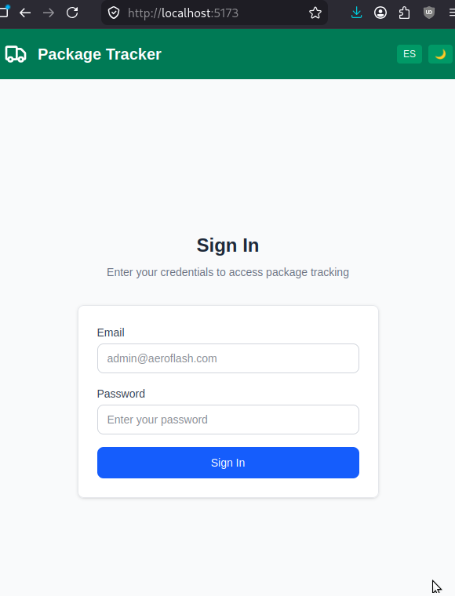
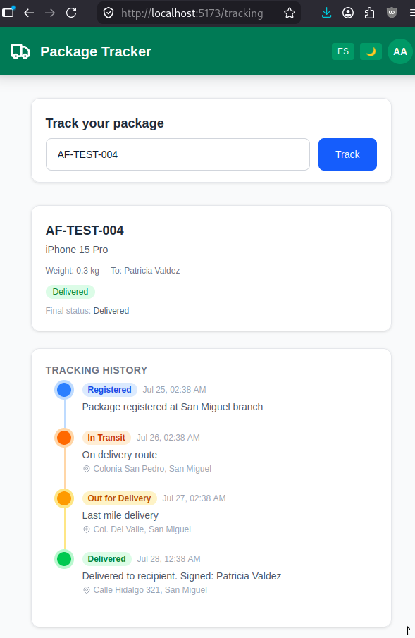
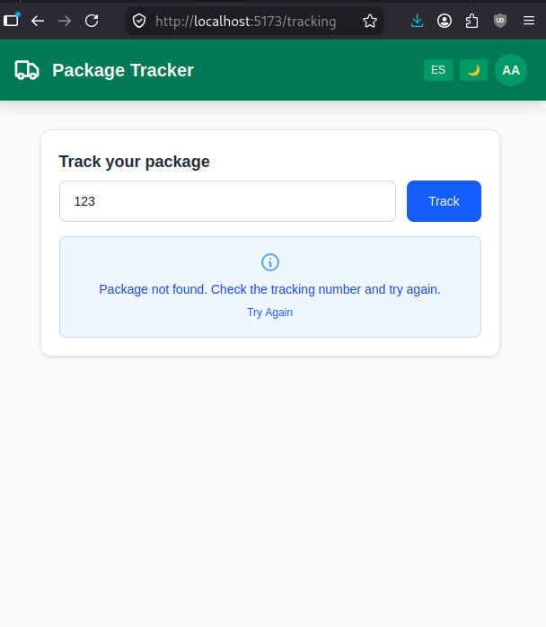
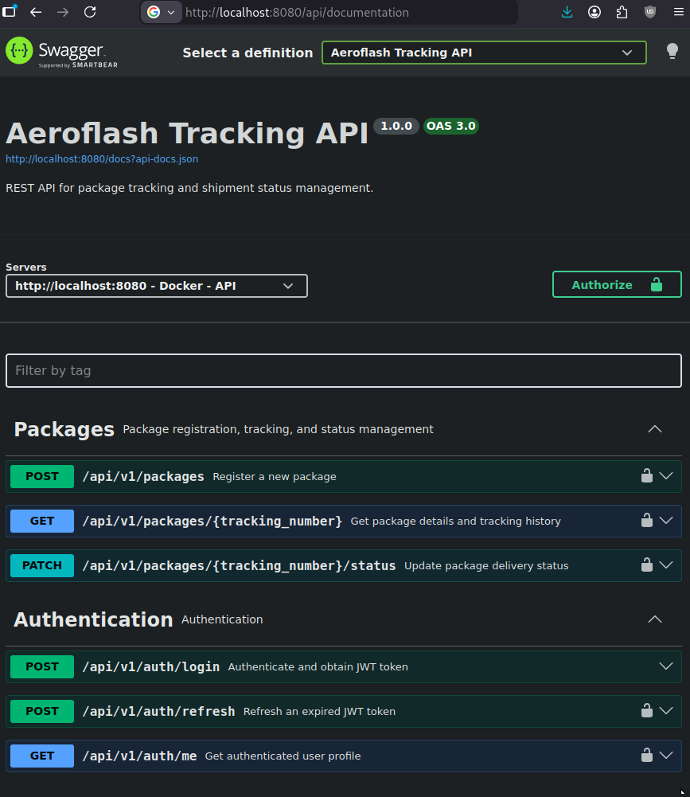

# Aeroflash Package Tracking API

API REST para registro, rastreo y gestión de estado de paquetes.

| Capa | Tecnología |
|---|---|
| **API Backend** | PHP 8.3 / Laravel 13 |
| **Frontend** | React 18 / Vite / TanStack Query |
| **Base de datos** | MySQL 8.0 |
| **Autenticación** | JWT (firebase/php-jwt) |
| **Documentación** | Swagger (OpenAPI 3.0) |
| **Contenedores** | Docker + Docker Compose |

## Inicio rápido con Docker

```bash

git clone https://github.com/eduardoguerrero/tracking-app

cd tracking-app

cp .env.example .env # crea .env con credenciales por defecto
```

Las credenciales se configuran en el archivo `.env` en la raíz del proyecto (copiar desde `.env.example`). **Se muestran aquí solo para pruebas, en un proyecto real las credenciales nunca deben exponerse en el README.**

| Variable | Valor por defecto |
|---|---|
| `MYSQL_ROOT_PASSWORD` | `root_secret` |
| `MYSQL_DATABASE` | `aeroflash`|
| `MYSQL_USER` | `aeroflash`|
| `MYSQL_PASSWORD` | `aeroflash_secret`|

Ejecutar docker para levantar la API, fronted y la base de datos    MySQL

```bash
docker compose up -d --build
```

| Servicio           | URL                                       |
|--------------------|-------------------------------------------|
| **Frontend**       | `http://localhost:5173`                   |
| **API Swagger UI** | `http://localhost:8080/api/documentation` |
| **MySQL**          | `Puerto 3307`                             |

Las migraciones y datos de prueba se ejecutan automáticamente al iniciar. Para reconstruir después de cambios en el código:







```bash
docker compose down && docker compose up -d --build
```
#### Acceso a MySQL
```bash
docker compose exec mysql mysql -u aeroflash -paeroflash_secret aeroflash
```


## Credenciales de prueba del fronted

| Campo | Valor |
|-------|-------|
| Email | `admin@aeroflash.com` |
| Password | `password` |


## Frontend (React) — Desarrollo local

Sin Docker, ejecutar el frontend localmente. Ubicado en `/frontend`.

```bash
cd frontend
cp .env.example .env            # VITE_API_URL=http://localhost:8080/api/v1
npm install
npm run dev
```

- **App**: `http://localhost:5173`
- **Login**: `admin@aeroflash.com` / `password`
- Apunta a la API en `http://localhost:8080/api/v1` (configurable en `.env`)

Stack: **React 18 + Vite + TanStack Query + Tailwind CSS**.

## Documentación de la API (Swagger)

Swagger UI disponible en: **`http://localhost:8080/api/documentation`**



### Endpoints

| Método | Endpoint | Auth | Descripción |
|--------|----------|------|-------------|
| `POST` | `/api/v1/auth/login` | No | Autenticar y obtener token JWT |
| `POST` | `/api/v1/auth/refresh` | Bearer JWT | Refrescar token expirado |
| `GET` | `/api/v1/auth/me` | Bearer JWT | Obtener perfil del usuario |
| `POST` | `/api/v1/packages` | Bearer JWT | Registrar un nuevo paquete |
| `GET` | `/api/v1/packages/{tracking_number}` | Bearer JWT | Obtener detalle e historial del paquete |
| `PATCH` | `/api/v1/packages/{tracking_number}/status` | Bearer JWT | Actualizar estado del paquete |

### Flujo de estados

```
Registered → In Transit → Out for Delivery → Delivered
     ↓            ↓              ↓
  Cancelled   Cancelled      Cancelled
```

- Cambiar a **In Transit** requiere un `courier_id` y `vehicle_id` activos
- Transiciones inválidas retornan `400`

## Datos de prueba

| Número de rastreo | Estado |
|-------------------|--------|
| `AF-TEST-001` | Registered |
| `AF-TEST-002` | In Transit |
| `AF-TEST-003` | Out for Delivery |
| `AF-TEST-004` | Delivered |
| `AF-TEST-005` | Cancelled |

## Ejecutar unit tests

```bash
cd backend && php artisan test
```

## Arquitectura

Clean Architecture con tres capas:

```
app/
├── Domain/              # Entidades de negocio, enums, interfaces de repositorio
├── Application/         # Casos de uso, DTOs, objetos de respuesta
└── Infrastructure/      # Modelos Eloquent, implementaciones de repositorio, JWT
```

### Patrones de diseño

| Patrón | Donde se aplica |
|---|---|
| **Repository** | `PackageRepositoryInterface` → `EloquentPackageRepository` |
| **DTO** | `RegisterPackageDTO`, `UpdatePackageStatusDTO`, `AuthResponse`, `PackageResponse` |
| **Use Case / Interactor** | `RegisterPackageUseCase`, `GetPackageUseCase`, `UpdatePackageStatusUseCase` |
| **State Machine** | `PackageStatusEnum` con transiciones de estado |
| **Dependency Injection** | Bindings en `AppServiceProvider` |

## Seguridad

### Pipeline CI/CD

Escaneo automático de seguridad vía GitHub Actions (`.github/workflows/security-scan.yml`) en cada push, PR y semanalmente:

| Herramienta | Tipo | Descripción |
|---|---|---|
| **Semgrep** | SAST | Analiza código fuente en busca de vulnerabilidades y patrones inseguros |
| **OWASP Dependency-Check** | SCA | Escanea `composer.lock` en busca de dependencias con CVEs conocidos |
| **TruffleHog** | Secrets | Escanea el repositorio en busca de credenciales, API keys y tokens |

### Autenticación — JWT

Todos los endpoints de paquetes están protegidos con **JWT (JSON Web Token)** mediante `App\Infrastructure\Auth\JwtAuthService`.


### Validación de entradas — LoginRequest

`app/Http/Requests/LoginRequest.php` aplica defensas en capas **antes** de que la petición llegue al controlador:

### Buenas prácticas OWASP

- **Autenticación JWT** en todos los endpoints de paquetes (`firebase/php-jwt`, stateless, configurable vía `JWT_SECRET`)
- **Rate limiting**: 5 intentos de login/minuto por IP + email (protección anti fuerza bruta)
- **Validación de entradas** vía FormRequests con sanitización (`trim`, `mb_strtolower`, verificación DNS)
- **Prevención XSS**: `XssSanitizer` elimina etiquetas HTML; middleware `SecurityHeaders` agrega `X-Content-Type-Options`, `X-Frame-Options`, `Referrer-Policy`
- **Consultas parametrizadas** vía Eloquent ORM (prevención de SQL Injection)
- **Hash bcrypt** mediante `Hash::check()` con BCRYPT_ROUNDS=12
- **Sin enumeración de usuarios**: mensaje genérico "Invalid credentials"
- **JWT de corta duración**: token expira en 1 hora, con ventana de refresco de 2 semanas
- **Respuestas de error estandarizadas** (400, 401, 404, 500)
- **TruffleHog** escanea cada commit en busca de secretos

### Servicios Docker

| Servicio | Contenedor | Puerto | Descripción |
|---|---|---|---|
| **api** | `aeroflash-api` | `8080:80` | Laravel API (nginx + PHP-FPM vía supervisor) |
| **frontend** | `aeroflash-frontend` | `5173:5173` | Vite dev server con React |
| **mysql** | `aeroflash-mysql` | `3307:3306` | MySQL 8.0 con volumen persistente |
